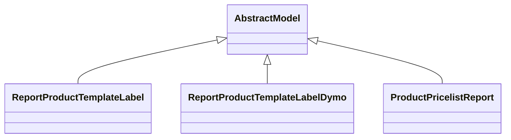

# Reports

Report definitions and templates in product.

## Available Reports

### PDF/Document Reports
- **Product Label (PDF)** (PDF/Print)
- **Product Packaging (PDF)** (PDF/Print)
- **Pricelist** (PDF/Print)
- **Dymo Label Sheet** (PDF/Print)
- **Product Label (PDF)** (PDF/Print)

## Report Files

- **__init__.py** (Python logic)
- **product_label_report.py** (Python logic)
- **product_packaging.xml** (XML template/definition)
- **product_pricelist_report.py** (Python logic)
- **product_pricelist_report_templates.xml** (XML template/definition)
- **product_product_templates.xml** (XML template/definition)
- **product_reports.xml** (XML template/definition)
- **product_template_templates.xml** (XML template/definition)

## Notes
- Named reports above are accessible through Odoo's reporting menu
- Python files define report logic and data processing
- XML files contain report templates, definitions, and formatting
- Reports are integrated with Odoo's printing and email systems
