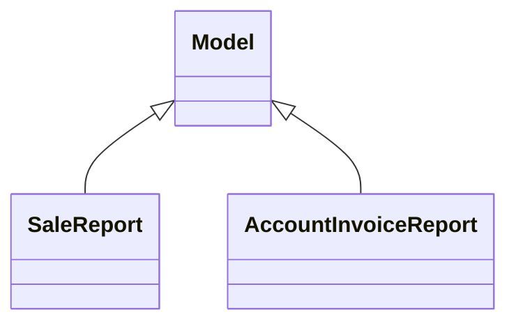

# Reports

Report definitions and templates in sale.

## Available Reports

### PDF/Document Reports
- **Quotation / Order** (PDF/Print)
- **PRO-FORMA Invoice** (PDF/Print)

### Analytical/Dashboard Reports
- **Quotations Analysis** (Analysis/Dashboard)
- **Sales Analysis** (Analysis/Dashboard)
- **Invoices Analysis** (Analysis/Dashboard)

## Report Files

- **account_invoice_report.py** (Python logic)
- **account_invoice_report_views.xml** (XML template/definition)
- **__init__.py** (Python logic)
- **ir_actions_report_templates.xml** (XML template/definition)
- **ir_actions_report.xml** (XML template/definition)
- **sale_report.py** (Python logic)
- **sale_report_views.xml** (XML template/definition)

## Notes
- Named reports above are accessible through Odoo's reporting menu
- Python files define report logic and data processing
- XML files contain report templates, definitions, and formatting
- Reports are integrated with Odoo's printing and email systems
