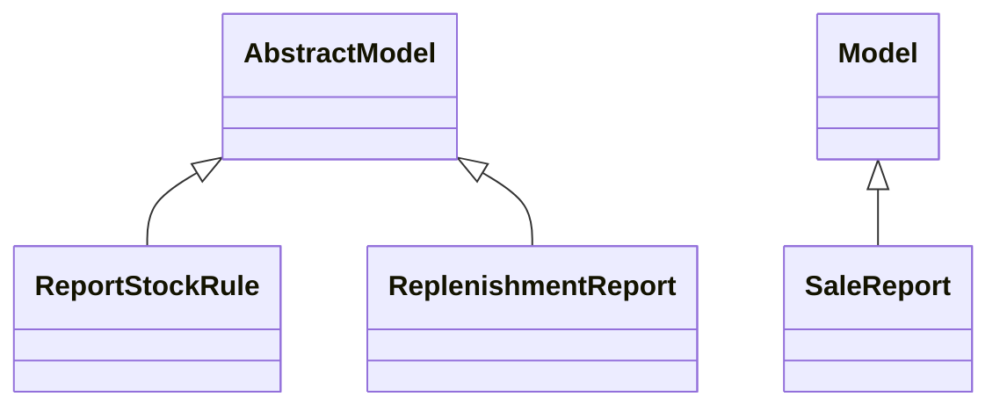

# Reports

Report definitions and templates in sale_stock.

## Available Reports

No named reports found in XML files.

## Report Files

- **__init__.py** (Python logic)
- **report_stock_forecasted.xml** (XML template/definition)
- **report_stock_rule.py** (Python logic)
- **sale_order_report_templates.xml** (XML template/definition)
- **sale_report.py** (Python logic)
- **stock_forecasted.py** (Python logic)
- **stock_report_deliveryslip.xml** (XML template/definition)

## Notes
- Named reports above are accessible through Odoo's reporting menu
- Python files define report logic and data processing
- XML files contain report templates, definitions, and formatting
- Reports are integrated with Odoo's printing and email systems
