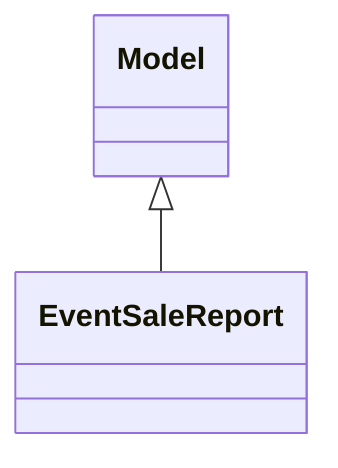

# Reports

Report definitions and templates in website_event_sale.

## Available Reports

No named reports found in XML files.

## Report Files

- **event_sale_report.py** (Python logic)
- **event_sale_report_views.xml** (XML template/definition)
- **__init__.py** (Python logic)

## Notes
- Named reports above are accessible through Odoo's reporting menu
- Python files define report logic and data processing
- XML files contain report templates, definitions, and formatting
- Reports are integrated with Odoo's printing and email systems
